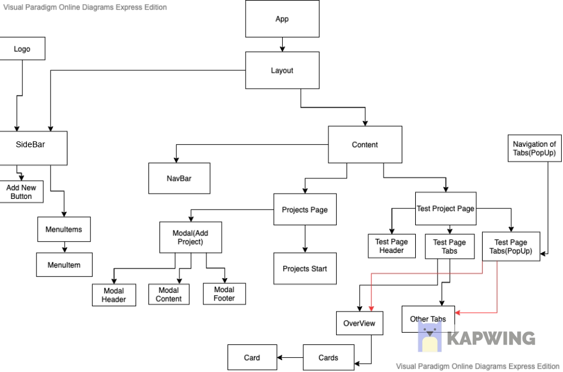
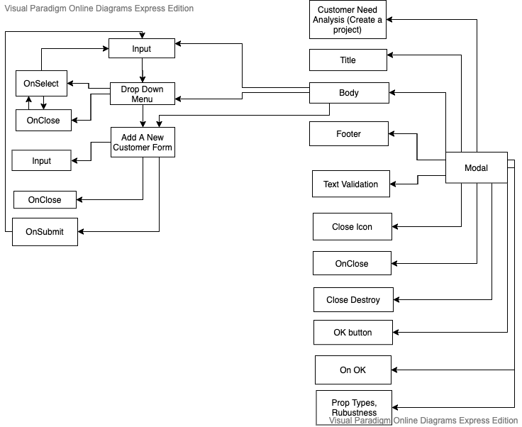

This project was bootstrapped with [Create React App](https://github.com/facebook/create-react-app).

Demo Website: https://quizzical-morse-f2a22a.netlify.app/

A simple Create Project Work Flow

- Click on Projects on the Sidebar

- On the Project Page, click on "Start a Project"

- Once completed, it will direct you to the test project page

Component Design Flow Chart

Modal Design Flow Chart

Spirits borrowed from Ant Design(https://ant.design/) and Material Design(https://material-ui.com/)

